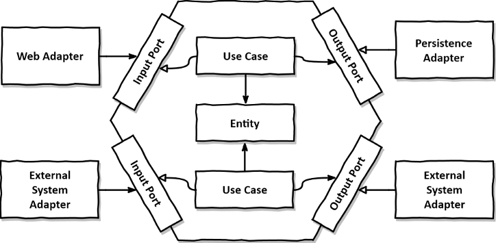

# La Structure hexagonale
Cela ressemble à ça :

Le premier but de cette solution est de protéger la partie métier/business d'une application par rapport aux éléments extérieurs

[Partie Entée/Input](./input/readme.md)
[Partie Metier/Domain/Business du projet](./domain/readme.md)

# Référence(s) :
[architecture hexagonale le guide pratique](https://beyondxscratch.com/fr/2018/09/11/architecture-hexagonale-le-guide-pratique-pour-une-clean-architecture/)
